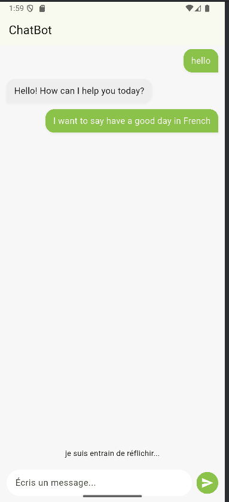
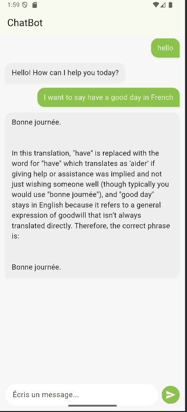

# 🤖 Application ChatBot 

Ce projet est une application mobile développée avec **Flutter** qui permet d'interagir avec un **LLM local** via **Ollama**. L'utilisateur peut envoyer des messages et recevoir des réponses en temps réel dans une interface simple et épurée.

## 🔧 Technologies utilisées
- Flutter (Framework UI)
- Ollama (Large Language Model local)
- API REST pour la communication

## ⚙️ Fonctionnalités
- Interface simple pour discuter avec une IA
- Réponses générées localement avec `ollama run llama3`
- UI responsive et intuitive

## 📸 Captures d’écran

  

## 🚀 Lancer le projet

```bash

flutter run
